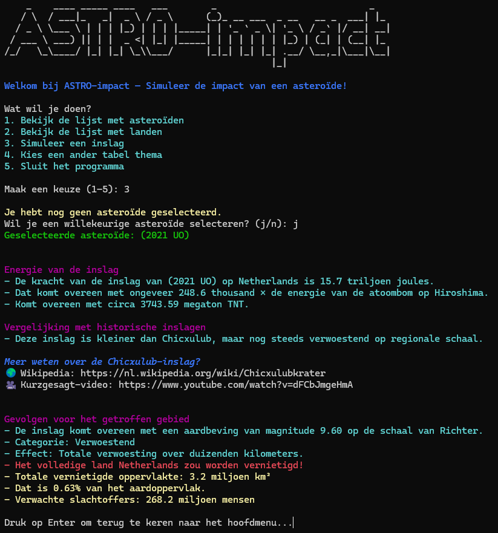

# ASTRO-impact




**ASTRO-impact** is een interactieve command-line applicatie geschreven in Python.
Met ASTRO-impact kun je simuleren wat er gebeurt als een asteroïde de aarde raakt, inclusief energie, schade, slachtoffers en vergelijkingen met historische inslagen zoals Chicxulub.

### Functies

Met ASTRO-impact kun je:

* Near-Earth asteroïden bekijken via de NASA API
* Landinformatie ophalen via de REST Countries API
* Een willekeurige of specifieke asteroïde en land selecteren
* De impact simuleren met berekende energie, magnitude en schade
* Vergelijken met de Chicxulub-inslag en de schaal van Richter
* Tabelthema’s kiezen voor een gepersonaliseerde weergave
* Werken met een lokale JSON-cache voor snelle API-laadtijden

### Gebruikte libraries

* **requests** – API-verkeer (NASA en REST Countries)
* **prettytable**, **colortable** – tabellen en thema’s
* **cprint**, **pyfiglet** – kleurrijke CLI en ASCII-art
* **humanize** – leesbare getallen (zoals ‘miljoen’ of ‘miljard’)
* **math**, **random**, **datetime**, **os**, **platform** – standaard Python-modules
* **dotenv** – voor veilige API-key opslag

### Over dit project

ASTRO-impact is ontwikkeld als eindproject binnen de module *Programming Fundamentals* bij NOVI Hogeschool.
Het project combineert API-integratie, bestandsbeheer, datastructuren, wiskundige berekeningen en gebruikersinteractie in een visueel aantrekkelijke CLI-simulatie.

### English summary

*ASTRO-impact is an interactive Python CLI simulation that models asteroid impacts on Earth using live NASA data. It calculates energy, magnitude, and damage estimates, comparing them to real-world events like the Chicxulub impact, with dynamic tables, colorful output, and API integrations.*

---

## ⚙️ Installatie & gebruik

### Vereisten

* **Python 3.10 of hoger**
* Een gratis **NASA API key** (verkrijgbaar via [api.nasa.gov](https://api.nasa.gov))

---

### Stap 1 - Clone de repository

```bash
git clone https://github.com/Steffan1988/astro-impact.git
cd astro-impact
```

---

### Stap 2 - Maak een virtuele omgeving (optioneel, maar aanbevolen)

**Windows (PowerShell):**

```powershell
python -m venv venv
venv\Scripts\activate
```

**macOS / 🐧 Linux (bash/zsh):**

```bash
python3 -m venv venv
source venv/bin/activate
```

---

### Stap 3 - Installeer de dependencies

```bash
pip install -r requirements.txt
```

---

### Stap 4 - Voeg je NASA API key toe

**Windows:**

```powershell
copy .env_example .env
notepad .env
```

**macOS / Linux:**

```bash
cp env_example .env
nano .env
```

Vul vervolgens je eigen key in en sla het document op:

---

### Stap 5 - Start de applicatie

```bash
python astro_impact.py
```

Als alles correct is geïnstalleerd, verschijnt het **ASCII-welkomstscherm**
```bash
    _    ____ _____ ____   ___        _                            _   
   / \  / ___|_   _|  _ \ / _ \      (_)_ __ ___  _ __   __ _  ___| |_ 
  / _ \ \___ \ | | | |_) | | | |_____| | '_ ` _ \| '_ \ / _` |/ __| __|
 / ___ \ ___) || | |  _ <| |_| |_____| | | | | | | |_) | (_| | (__| |_ 
/_/   \_\____/ |_| |_| \_\\___/      |_|_| |_| |_| .__/ \__,_|\___|\__|

Welkom bij ASTRO-impact — Simuleer de impact van een asteroïde!

Wat wil je doen?
1. Bekijk de lijst met asteroïden
2. Bekijk de lijst met landen
3. Simuleer een inslag
4. Kies een ander tabel thema
5. Sluit het programma

Maak een keuze (1–5): 
````

⚠️ Let op:
Bij de eerste start haalt ASTRO-impact de Near-Earth Object-data op via de NASA API.
Dit kan tot ongeveer één minuut duren, omdat de dataset lokaal wordt gecachet.
Volgende starts gaan daarna veel sneller.

---

✅ **Getest met:**

* Python 3.12
* Windows 11

💻 *Compatibel met macOS en Linux.*

